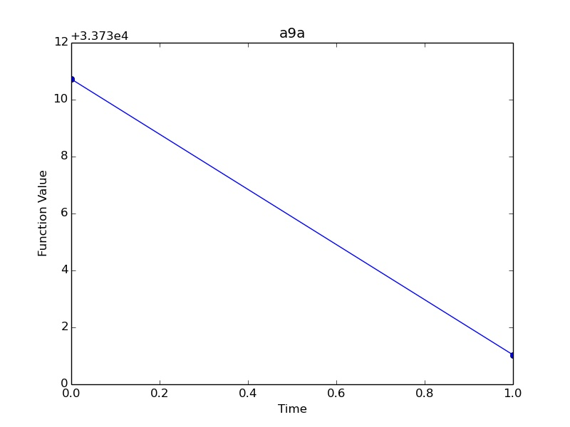
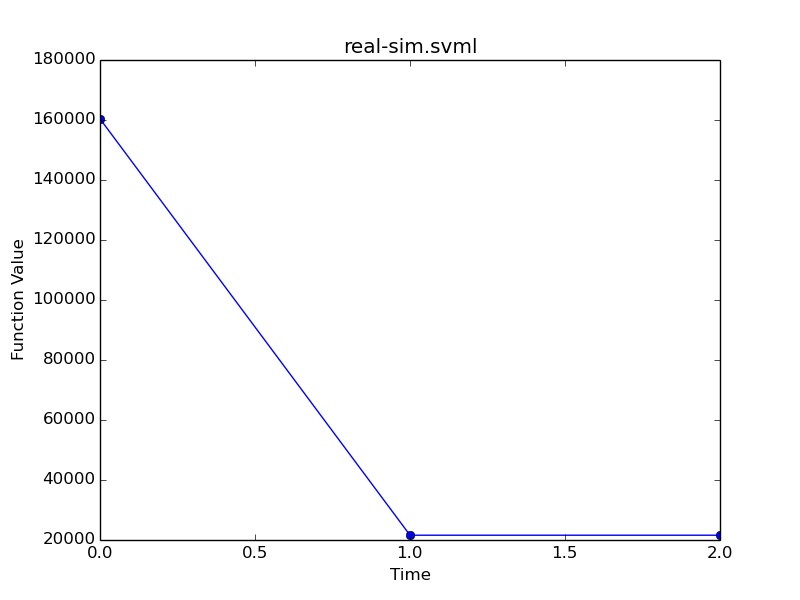
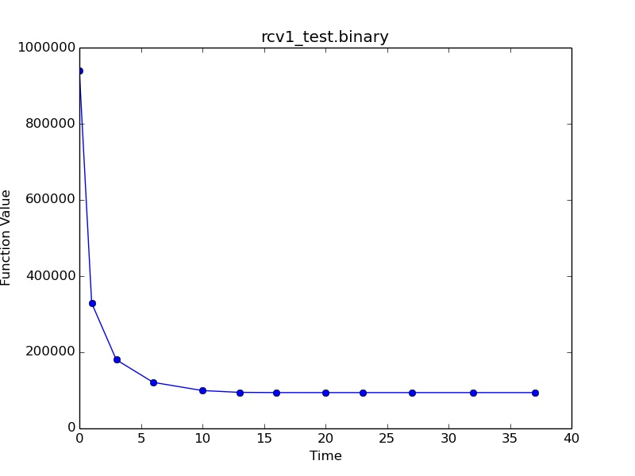
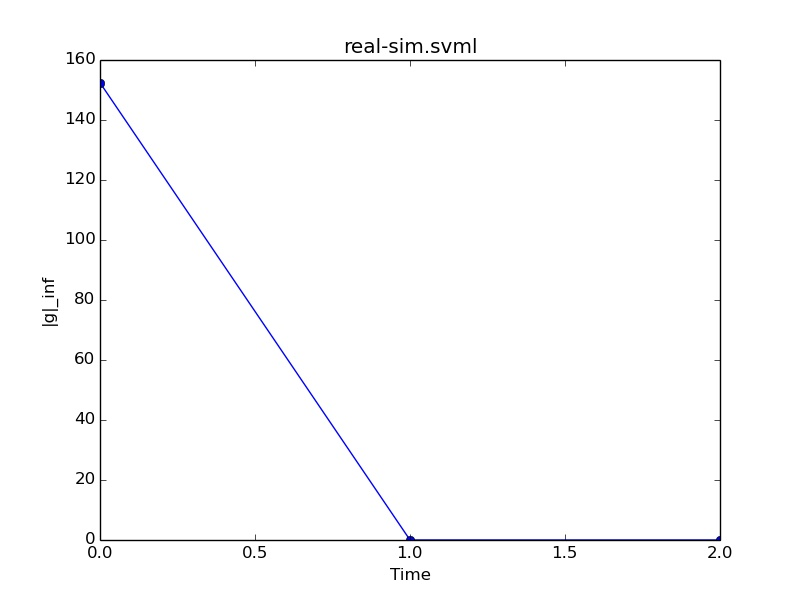

#Trust Region Newton Method using C++

The results in the following tables are obtained on some of the datasets (using [logisticRegression_table.cpp](logisticRegression_table.cpp)):

Time is in seconds.

For a9a:

| C             | CV            | Time  |
| ------------- |:-------------:| -----:|
| 0.25          | 84.730199     |   3   |
| 1             | 84.665704     |   2   |
| 4             | 84.671847     |   5   |
| 16            | 84.653420     |   8   |

For real-sim.svml:

| C             | CV            | Time  |
| ------------- |:-------------:| -----:|
| 0.25          | 95.846990     |   3   |
| 1             | 96.997607     |   7   |
| 4             | 97.424940     |   10  |
| 16            | 97.516215     |   15  |

For news20.binary:

| C             | CV            | Time  |
| ------------- |:-------------:| -----:|
| 0.25          | 89.652931     |   17  |
| 1             | 93.403681     |   26  |
| 4             | 95.624125     |   41  |
| 16            | 96.249250     |   58  |

For rcv1_test.binary:

| C             | CV            | Time  |
| ------------- |:-------------:| -----:|
| 0.25          | 97.179949     |   31  |
| 1             | 97.548712     |   49  |
| 4             | 97.710803     |   76  |
| 16            | 97.691612     |   113 |

Following charts are obtained on the same datasets (using [logisticRegression_chart1.cpp](logisticRegression_chart1.cpp)). The charts show function value versus time(in seconds).

Following charts are obtained on the same datasets (using [logisticRegression_chart2.cpp](logisticRegression_chart2.cpp)). The charts show infinite norm of function gradient value versus time(in seconds).

All the charts were plotted using [plot.py](plot.py)
