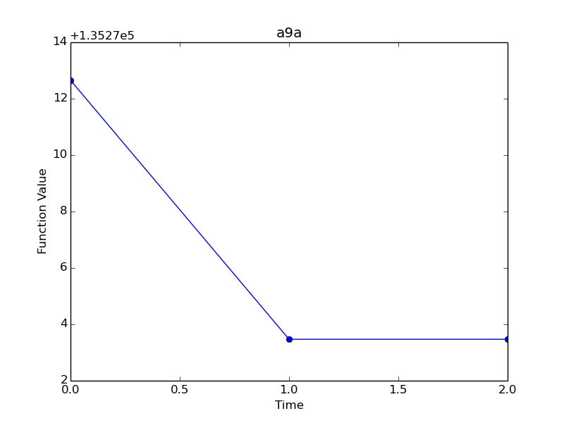
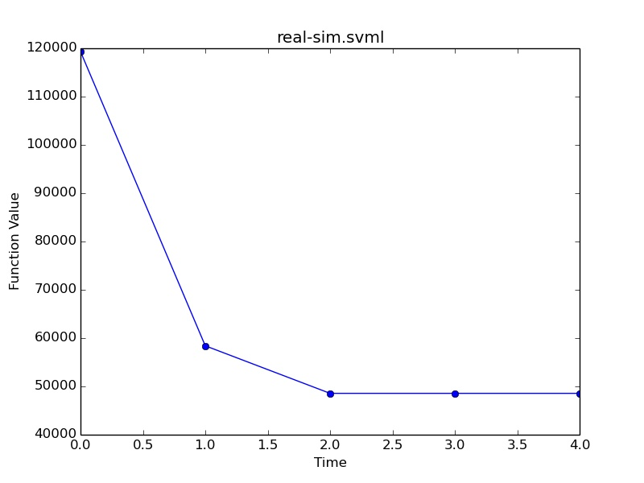
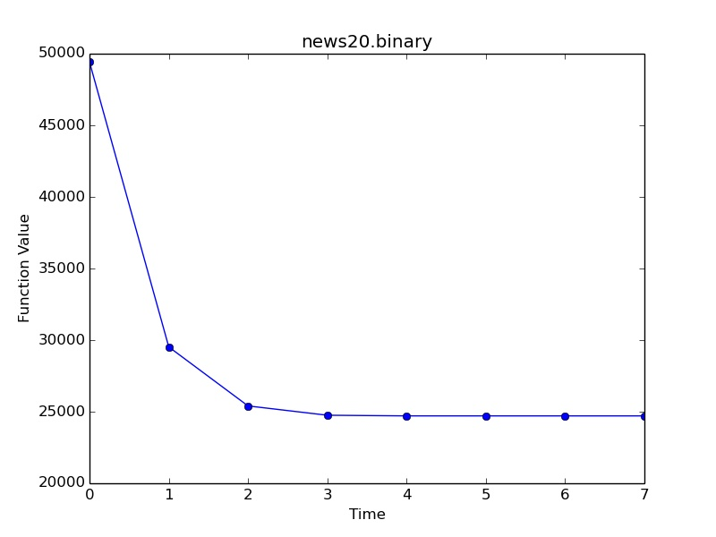
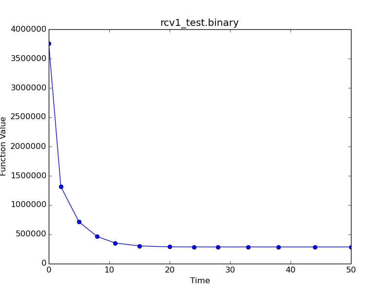
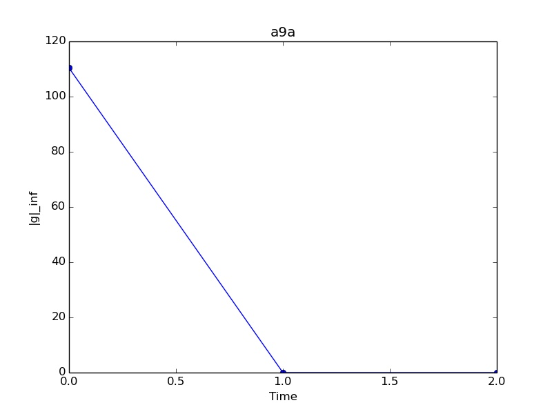
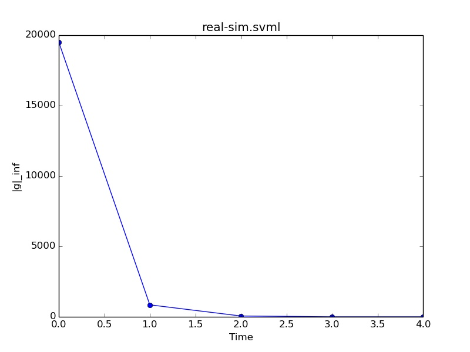
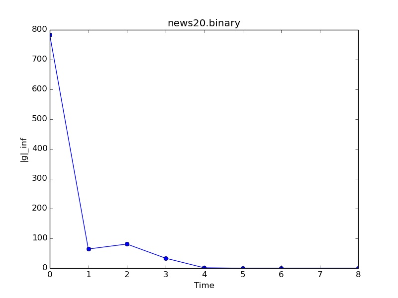
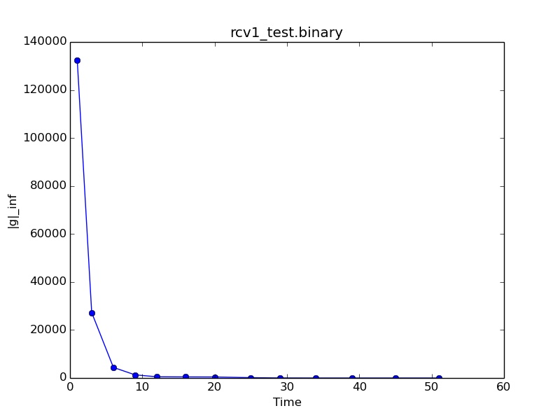

#Trust Region Newton Method using Python

The results in the following tables are obtained on some of the datasets (using [logisticRegression_table.py](logisticRegression_table.py)):

Time is in seconds.

For a9a:

| C             | CV            | Time  |
| ------------- |:-------------:| -----:|
| 0.25          | 84.733270     |   6   |
| 1             | 84.711772     |   7   |
| 4             | 84.733270     |   9   |
| 16            | 84.724056     |   12  |

For real-sim.svml:

| C             | CV            | Time  |
| ------------- |:-------------:| -----:|
| 0.25          | 95.888479     |   12  |
| 1             | 97.003139     |   16  |
| 4             | 97.434621     |   19  |
| 16            | 97.510683     |   24  |

For news20.binary:

| C             | CV            | Time  |
| ------------- |:-------------:| -----:|
| 0.25          | 89.632927     |   13  |
| 1             | 93.463693     |   20  |
| 4             | 95.509102     |   31  |
| 16            | 96.214243     |   41  |

For rcv1_test.binary:

| C             | CV            | Time  |
| ------------- |:-------------:| -----:|
| 0.25          | 97.187035     |   45  |
| 1             | 97.561998     |   57  |
| 4             | 97.730879     |   78  |
| 16            | 97.699731     |   102 |

Following charts are obtained on the same datasets (using [logisticRegression_chart1.py](logisticRegression_chart1.py)). The charts show function value versus time(in seconds).

Following charts are obtained on the same datasets (using [logisticRegression_chart2.py](logisticRegression_chart2.py)). The charts show infinite norm of function gradient value versus time(in seconds).

All the charts were plotted using [plot.py](plot.py)
